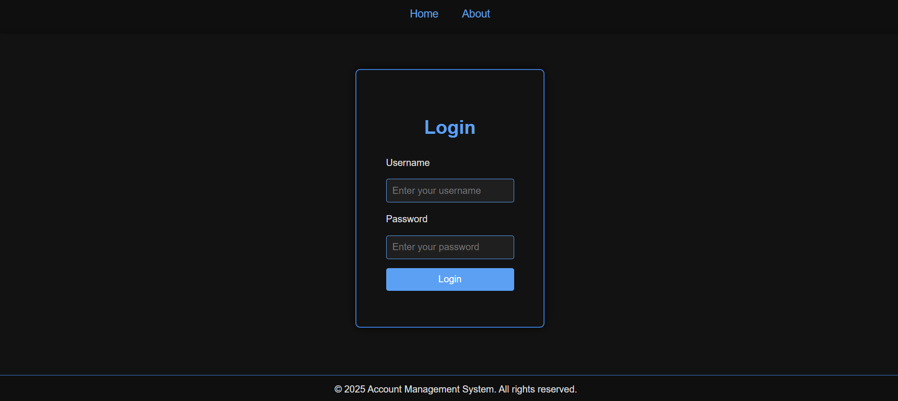
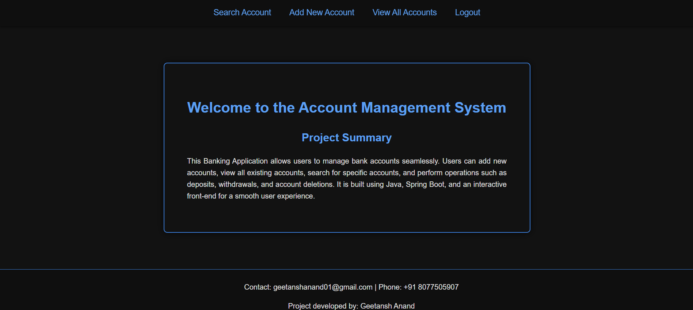
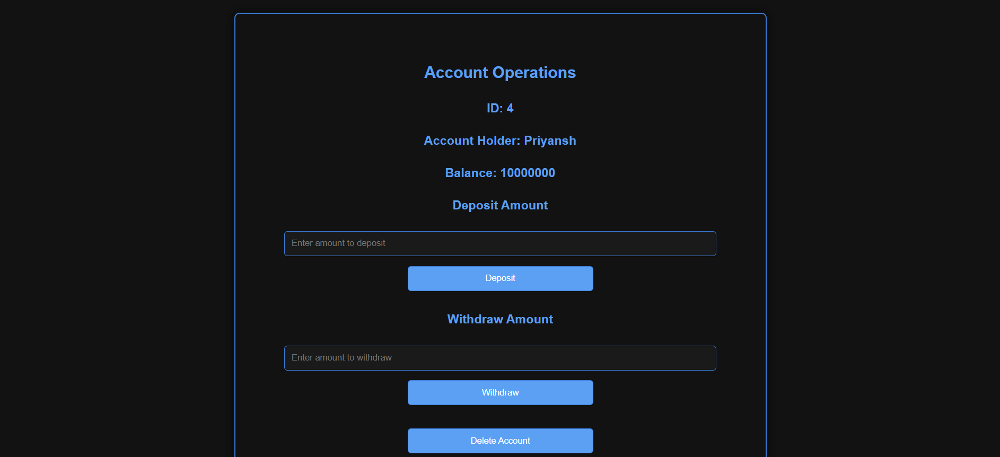
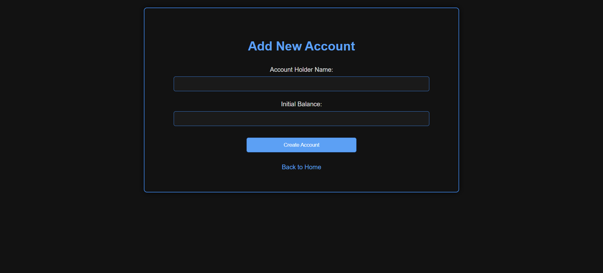
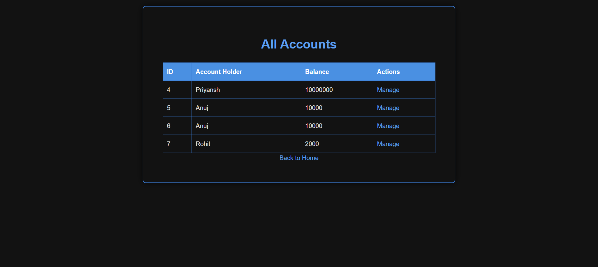

# Banking Application

This project is a **Banking Application** built with **Spring Boot**. It provides a user-friendly interface for managing bank accounts, viewing account details, and performing basic banking operations. The project is designed with a responsive and modern UI, following a black-and-bluish artistic theme.

---

## Table of Contents

- [Features](#features)
- [Technologies Used](#technologies-used)
- [Installation](#installation)
- [Usage](#usage)
- [Project Structure](#project-structure)
- [Screenshots](#screenshots)
- [License](#license)

---

## Features

- **Account Management**: Add, search, and view bank accounts.
- **Account Operations**: Perform deposits, withdrawals, and balance checks.
- **Responsive Design**: Optimized for all devices.
- **Thematic UI**: Includes smooth animations, hover effects, and a classic black-and-bluish theme.
- **Dynamic Navigation**: Side menu bar for easy navigation.
- **Secure Login**: Login page secured with Spring Security.

---

## Technologies Used

- **Back-End**: Spring Boot, Spring Security, Hibernate, Maven
- **Database**: MySQL
- **Front-End**: HTML, CSS, JavaScript
- **APIs and Libraries**: JDBC, Hibernate

---

## Installation

1. Clone the repository:
   ```bash
   git clone https://github.com/GeetanshAnand/Banking-Application.git
   ```

2. Navigate to the project directory:
   ```bash
   cd Banking-Application
   ```

3. Configure the database connection in the `application.properties` file:
   ```properties
   spring.datasource.url=jdbc:mysql://localhost:3306/your_database_name
   spring.datasource.username=your_username
   spring.datasource.password=your_password
   ```

4. Build and run the project using Maven:
   ```bash
   mvn spring-boot:run
   ```

5. Access the application in your browser at:
   ```
   http://localhost:8080/
   ```

---

## Usage

- **Login**: Use the `/login` page to log in with valid credentials.
- **Home Page**: View the project summary and navigate to other pages using the side menu.
- **Account Operations**: Perform deposits, withdrawals, and balance inquiries.
- **View Accounts**: View a list of all accounts in a table with hover and animation effects.
- **Add Account**: Create a new bank account with essential details.
- **Search Account**: Search for a specific account using its ID or other parameters.

---

## Project Structure

```plaintext
├── src/main
│   ├── java
│   │   ├── com.example.banking   # Main application code
│   │   │   ├── controller        # Controllers for handling requests
│   │   │   ├── account entity    # Entity class
│   │   │   ├── account dto       # Data transfer object
│   │   │   ├── repository        # Database repositories
│   │   │   ├── service           # Business logic services
│   │   │   ├── security          # Login and Authorization
│   │   │   └── BankingApplication.java  # Main class
│   ├── resources
│   │   ├── static                # CSS and JS files
│   │   ├── templates             # HTML files
│   │   └── application.properties # Configuration
└── README.md                     # Project documentation (this file)
```

---

## Screenshots

### 1. Login Page


### 2. Home Page


### 3. Account Operations Page


### 4. Add Account Page


### 5. View Accounts Page


---

## License

This project is licensed under the MIT License. You may use, modify, and distribute this project freely under the terms of the MIT License. See the [LICENSE](LICENSE) file for more details.

---
