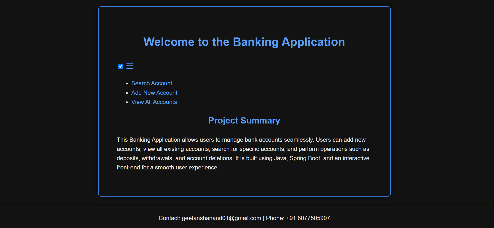
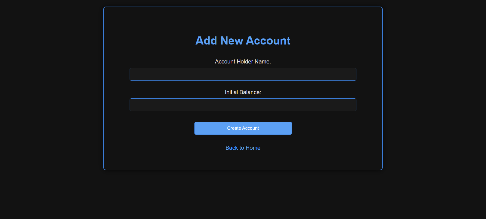
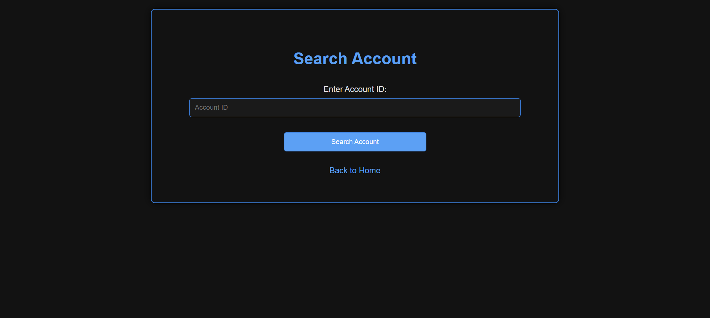
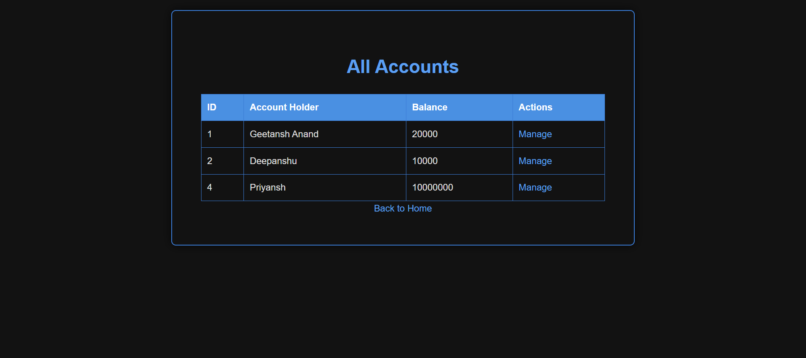
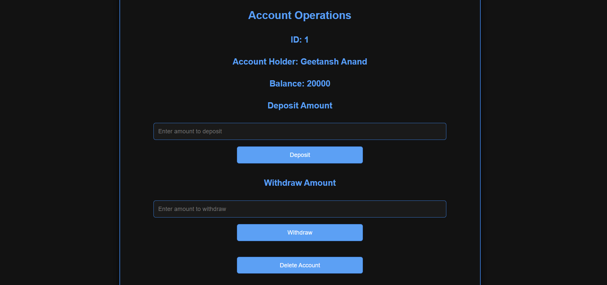

# Banking Application

### Objective:
To design and implement a banking application that allows users to manage bank accounts with functionalities such as adding, searching, viewing, and managing accounts. The project is developed using Java, Spring Boot, HTML, CSS, and MySQL for database interaction.

### Technologies Used:
- **Frontend**: HTML, CSS, JavaScript
- **Backend**: Java, Spring Boot
- **Database**: MySQL
- **Other**: JDBC (Java Database Connectivity), Maven for dependency management, REST API for communication

### Project Components:

#### 1. Index Page (`index.html`):
- A welcome page that introduces the user to the system.
- Provides a side menu with navigation links for account-related functionalities such as adding, searching, viewing, and managing accounts.
- Includes a summary section and a footer with contact details.
- Styled with a black and bluish theme for a classic and artistic look.

#### 2. Add New Account Page (`add_account.html`):
- A form that allows users to create a new bank account.
- Users can input the account holder's name and the initial balance.
- The form is validated on the frontend, and the data is sent to the backend for processing.
- Account creation is handled via a REST API call to the backend.

#### 3. Search Account Page (`search_account.html`):
- Allows users to search for a specific account by entering the account ID.
- Displays the account details including the ID, account holder name, and balance.
- Provides a link to manage the account if it exists.
- Uses a REST API to fetch the account details from the backend.

#### 4. View All Accounts Page (`view_all_accounts.html`):
- Displays a table of all accounts with details such as account ID, account holder name, and balance.
- Each account has a "Manage" button that links to the account management page.
- Fetches data using a REST API call to retrieve all accounts from the backend.
- The table includes hover effects and is styled to be responsive.

#### 5. Spring Boot Application (`BankingApplication.java`):
- The main class for running the Spring Boot application.
- Uses the `@SpringBootApplication` annotation to auto-configure components.
- Serves as the entry point for the application and provides REST endpoints.

#### 6. Account Controller (`AccountController.java`):
- Handles the business logic for account-related operations.
- Defines endpoints for adding, searching, viewing, and managing accounts.
- Communicates with the service layer to interact with the database.

#### 7. Service Layer (`AccountService.java` and `AccountServiceImpl.java`):
- Defines the core business logic for managing accounts.
- The `AccountService` interface outlines the operations, and the `AccountServiceImpl` class provides their implementation.
- Interacts with the repository layer for CRUD operations on the database.

#### 8. DAO Layer (`AccountRepository.java`):
- Extends `JpaRepository` to interact with the MySQL database.
- Provides methods for saving, retrieving, updating, and deleting account data from the database.

#### 9. MySQL Database Setup:
- A MySQL database is used to store account details.
- The `accounts` table stores information like account ID, account holder name, and balance.
- Database connection settings are configured in the `application.properties` file.

### Workflow:

#### Account Management:
1. **Add Account**: Users can add a new account via the "Add New Account" page.
   - The form is processed by the backend and the data is stored in the MySQL database.
   
2. **Search Account**: Users can search for an account by entering the account ID.
   - If the account exists, its details are displayed, and the user is provided with a link to manage it.
   
3. **View All Accounts**: The "View All Accounts" page lists all existing accounts in the system.
   - Data is fetched from the MySQL database and displayed in a table format.
   
4. **Manage Account**: Users can manage an account by clicking the "Manage" button from the view or search pages.
   - This links to the account management functionalities like updating or deleting the account.

### Screenshots:

#### 1. Index Page

#### 2. Add Account Page

#### 3. Search Account Page

#### 4. View All Accounts Page

#### 5. Account Operations Page

### Database Schema:

- **Accounts Table**:
  - `id` (INT): Primary key, auto-incremented.
  - `account_holder_name` (VARCHAR): Name of the account holder.
  - `balance` (DECIMAL): Account balance.

### Features:
- Responsive design with a black and bluish theme that provides a classic and artistic feel.
- Interactive animations and hover effects across the application.
- RESTful API integration for backend communication.
- Full CRUD operations on accounts.
  
### Conclusion:
This project demonstrates a banking system application using Java, Spring Boot, and MySQL. It provides a clean separation of concerns across the controller, service, and repository layers, and covers essential account management operations such as adding, searching, viewing, and managing accounts.
